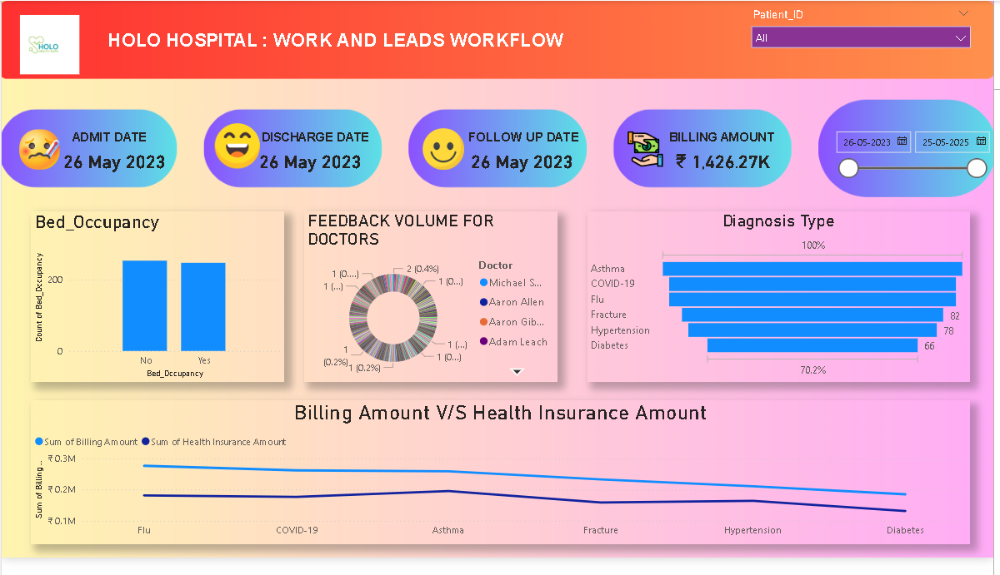

# 🏥 Power BI Healthcare Dashboard – HOLO Hospital

This project is a Power BI template (`.pbit`) that visualizes and analyzes key hospital metrics such as admissions, discharges, feedback, diagnosis types, and billing performance. It’s designed to simulate the decision-making tools used by hospitals to improve patient care and operational efficiency.

---

## 📊 Key Features

- Dynamic filters: Patient ID, date range, and diagnosis filters
- KPIs: Total Billing Amount, Admission & Discharge Dates, Follow-up Status
- Visualizations:
  - Bed occupancy status
  - Doctor feedback volume (donut chart)
  - Diagnosis type distribution (bar chart)
  - Billing vs Health Insurance trends (line chart)

---

## 🛠 Tools Used

- Power BI Desktop
- Power Query (ETL & data shaping)
- DAX (for custom metrics & KPIs)
- Excel / CSV (for data source simulation)

---

## 📁 Files Included

- `HealthcareDashboard.pbit` – Power BI Template File
- `Dashboard_Overview.png` – Screenshot of the dashboard (see below)
- `README.md` – This project description

---

## 📸 Dashboard Preview

This dashboard offers a comprehensive view of hospital operations, enabling interactive data exploration by users and stakeholders.

---

## 🚀 How to Use

1. Download the `.pbit` file from this repository.
2. Open it using **Power BI Desktop**.
3. Load your own healthcare dataset or simulated data (format must match the model).
4. Explore insights using the slicers and filters provided.

---

## 🧠 Insights Generated

- Identified common diagnoses by volume (e.g., asthma, COVID-19)
- Tracked bed occupancy trends
- Compared billing amounts with health insurance coverage
- Aggregated and visualized patient feedback by doctor

---

## 📬 Contact

For feedback or collaboration, feel free to open an issue or connect with me on www.linkedin.com/in/gopal-bhardwaj-6a4399215(#).

